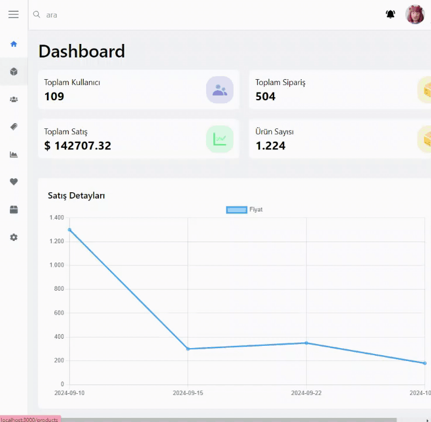

# Dashboard with Next.js

This project is an **Admin Dashboard** created using **Next.js**. The goal of the project is to build a functional admin panel where various operations such as viewing user data, creating statistics, and performing CRUD operations are carried out.

## Features

- **User Management**: 
  - View and manage user information.
  - Delete users from the system.
  
- **Sales Information**: 
  - Display sales statistics.
  - Generate and visualize sales data with charts and graphs.

- **Product Management**: 
  - Create new products.
  - Edit existing products.
  - Delete products from the system.

## Libraries and Technologies

- **Next.js**: Framework for server-side rendering and fast web development.
- **React**: For building dynamic user interfaces.
- **Axios**: For handling API requests.
- **Tailwind CSS**: For building responsive and modern user interfaces.

## Preview

# Dashboard---Next.js
